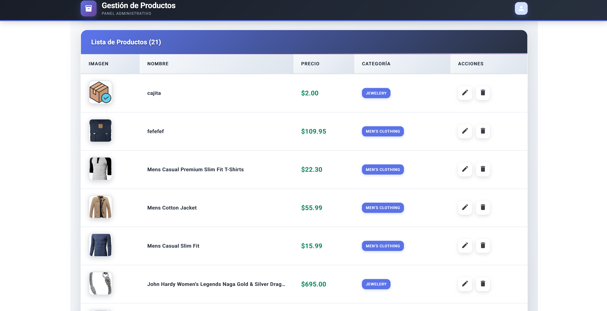
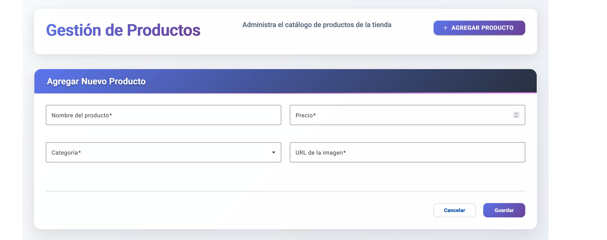
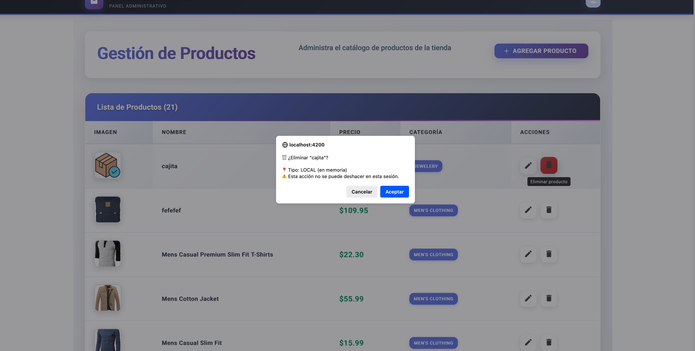

# 🛍️ Modern Product Store

Una aplicación moderna de gestión de productos con diseño ultra-vibrante, desarrollada con Angular 18+ y Angular Material. Consume la API pública de FakeStore para operaciones CRUD completas.

## ✨ Características

- **🎨 Diseño Ultra-Moderno**: Interfaz vibrante con gradientes y efectos glassmorphism
- **📱 100% Responsivo**: Optimizado para desktop, tablet y móvil
- **🔄 CRUD Completo**: Crear, editar y eliminar productos inline
- **⚡ Tiempo Real**: Actualizaciones instantáneas sin recargar página
- **🎭 Animaciones Fluidas**: Transiciones suaves y micro-interacciones
- **✅ Validaciones**: Formularios reactivos con validación en tiempo real
- **🌟 Hero Section**: Diseño impactante con call-to-action prominente

## 🚀 Demo en Vivo

[Ver Demo en Vercel](tu-url-de-vercel.app)

## 🛠️ Tecnologías

- **Angular 18+** - Framework principal con arquitectura standalone
- **Angular Material** - Componentes UI con tema Cyan/Orange
- **TypeScript** - Tipado fuerte y desarrollo escalable
- **RxJS** - Programación reactiva para manejo de estado
- **CSS3** - Gradientes avanzados y animaciones modernas
- **FakeStore API** - Backend público para datos de productos

## 📡 API Endpoints

- `GET /products` - Lista todos los productos
- `POST /products` - Crear nuevo producto
- `PUT /products/{id}` - Actualizar producto existente
- `DELETE /products/{id}` - Eliminar producto

> **Nota**: La API simula operaciones CRUD pero no persiste cambios reales

## 🏃‍♂️ Instalación Local

### Prerrequisitos
- Node.js 18+
- npm 9+
- Angular CLI

### Pasos

1. **Clonar repositorio**
   ```bash
   git clone https://github.com/tu-usuario/product-app-angular-tu-nombre.git
   cd product-app-angular-tu-nombre
   ```

2. **Instalar dependencias**
   ```bash
   npm install
   ```

3. **Ejecutar en desarrollo**
   ```bash
   ng serve
   ```

4. **Abrir en navegador**
   ```
   http://localhost:4200
   ```

## 📁 Estructura del Proyecto

```
src/
├── app/
│   ├── components/
│   │   └── product-list/          # Lista y gestión de productos
│   ├── models/
│   │   └── product.ts             # Interfaces TypeScript
│   ├── services/
│   │   └── product.service.ts     # Servicio HTTP para API
│   ├── app.component.ts           # Componente raíz con toolbar
│   └── app.routes.ts              # Configuración de rutas
├── main.ts                        # Bootstrap standalone
└── styles.css                     # Estilos globales
```

## 🎯 Funcionalidades

### 📋 Gestión de Productos
- **Vista de catálogo**: Grid responsivo con hover effects 3D
- **Hero section**: Diseño impactante con gradientes vibrantes
- **Sistema de rating**: Estrellas dinámicas con datos reales

### ➕ Crear Productos
- **Formulario inline**: Se despliega desde el hero section
- **Validaciones en tiempo real**: Campos obligatorios y formatos
- **Preview inmediato**: Los productos aparecen al instante

### ✏️ Editar Productos
- **Edición in-place**: Overlay modal directamente en cada card
- **Campos rápidos**: Solo título y precio para edición ágil
- **Feedback visual**: Confirmación inmediata de cambios

### 🗑️ Eliminar Productos
- **Confirmación nativa**: Diálogo del navegador para confirmación
- **Eliminación visual**: Producto desaparece inmediatamente
- **FABs flotantes**: Botones de acción siempre visibles

## 🎨 Decisiones de Diseño

### Sistema de Colores
- **Gradientes principales**: Violeta a púrpura (#667eea → #764ba2)
- **Acentos vibrantes**: Naranja a rojo (#ff6b6b → #feca57)
- **Backgrounds**: Gradientes suaves para profundidad visual

### Experiencia de Usuario
- **Arquitectura standalone**: Carga optimizada con lazy loading
- **Formularios reactivos**: Validación sin interrupciones
- **Feedback inmediato**: SnackBar con gradientes para notificaciones

### Animaciones
- **Hover effects 3D**: Cards que se elevan al pasar el mouse
- **Transiciones cubic-bezier**: Timing natural inspirado en Material Design
- **Micro-interacciones**: FABs que escalan y botones con efectos

## 🚀 Deployment en Vercel

### Método 1: GitHub Integration
1. Conecta tu repositorio con Vercel
2. Vercel detecta automáticamente Angular
3. Deploy automático en cada push

### Método 2: CLI
```bash
npm install -g vercel
ng build
vercel --prod
```

### Configuración Build
Vercel detecta automáticamente:
- **Build Command**: `ng build`
- **Output Directory**: `dist/product-app-angular-tu-nombre`
- **Install Command**: `npm install`

## 🔧 Scripts Disponibles

```bash
npm start          # Desarrollo local
npm run build      # Build de producción
npm run build:prod # Build optimizado
npm test           # Tests unitarios
npm run lint       # Linting código
```

## 🌟 Optimizaciones

- **Lazy loading**: Componentes cargados bajo demanda
- **TrackBy functions**: Rendering optimizado de listas
- **Async providers**: Carga asíncrona de animaciones
- **Responsive images**: Loading="lazy" para mejor performance

## 📱 Responsive Design

- **Desktop**: Grid de 3-4 columnas con efectos completos
- **Tablet**: Grid de 2 columnas adaptativo
- **Móvil**: Columna única con navegación optimizada

## 📝 Entregables del Proyecto

### ✅ Repositorio GitHub
- **README completo** con toda la documentación necesaria
- **Pasos detallados** para ejecutar la aplicación localmente
- **Enlace directo** a la API utilizada: [FakeStore API](https://fakestoreapi.com)
- **Capturas de pantalla** y demo funcional incluida
- **Enlace a demo en línea** desplegada en Vercel (opcional)

### 📊 Historial de Commits
El proyecto cuenta con un historial de commits bien estructurado y descriptivo:

```
fix: mejoras en el archivo readme (integracion de imagenes)
feat: mejoras en el comportamiento del CRUD
fix: corrección de estilos en texto al perderse en background  
fix: corregir contraste en navbar principal y simplificar chips de categoría
refactor: agregar tabla para una mejor gestión de productos
style: rediseñar completamente con estética futurista y glassmorphism
feat: creación del archivo readme
feat: implementar CRUD completo con formularios inline y edición visual
feat: crear lista de productos con diseño moderno
feat: configurar arquitectura standalone moderna con diseño angular material
initial commit
```

### 🎯 Cumplimiento de Requisitos
- ✅ **Tabla con productos** (nombre, precio, categoría, imagen)
- ✅ **Formulario para agregar** productos (simulado)
- ✅ **Edición de productos** usando formularios prellenados
- ✅ **Eliminación con confirmación** mediante diálogo nativo
- ✅ **Validaciones completas** en todos los campos de formularios
- ✅ **Indicadores visuales** de carga, éxito y error con SnackBar

## 🔗 Enlaces y Referencias

- [Repositorio GitHub](https://github.com/tu-usuario/product-app-angular-tu-nombre)
- [Demo en Vivo](https://tu-demo-url.vercel.app)
- [FakeStore API Documentation](https://fakestoreapi.com/docs)
- [Angular Documentation](https://angular.io/docs)
- [Angular Material Components](https://material.angular.io)
- [Vercel Deployment Guide](https://vercel.com/docs)

## 📸 Capturas de Pantalla

### Vista Principal - Tabla de Productos


### Formulario de Crear/Editar


### Confirmación de Eliminación


---
